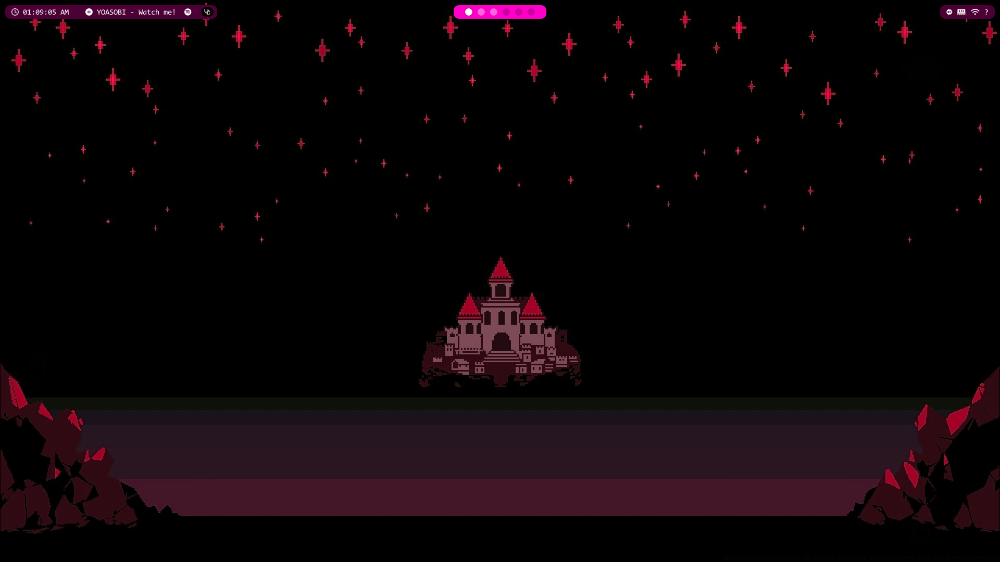
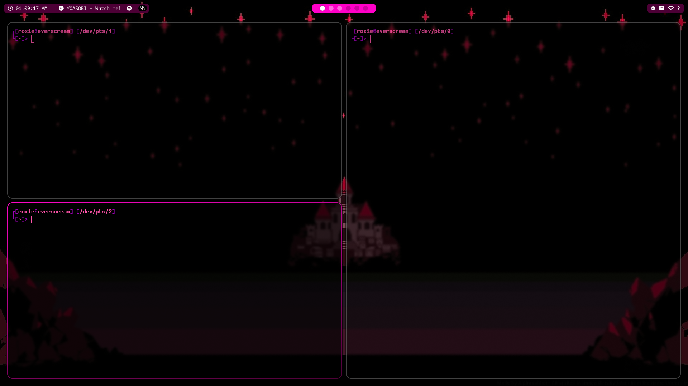
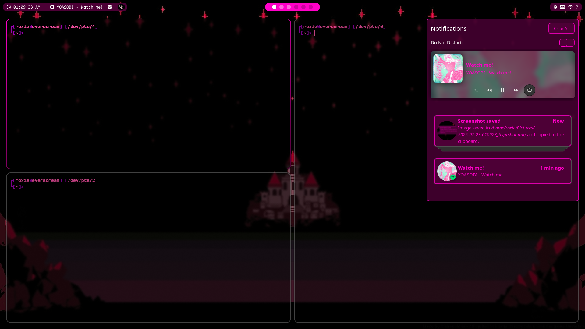
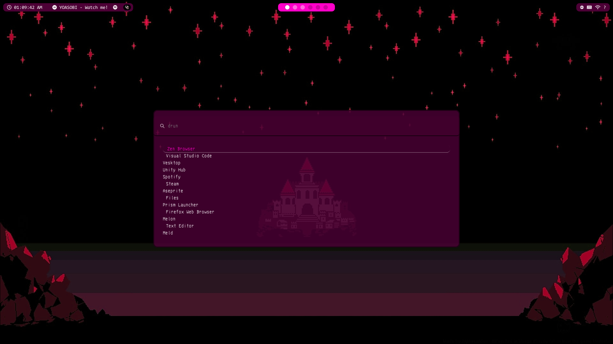
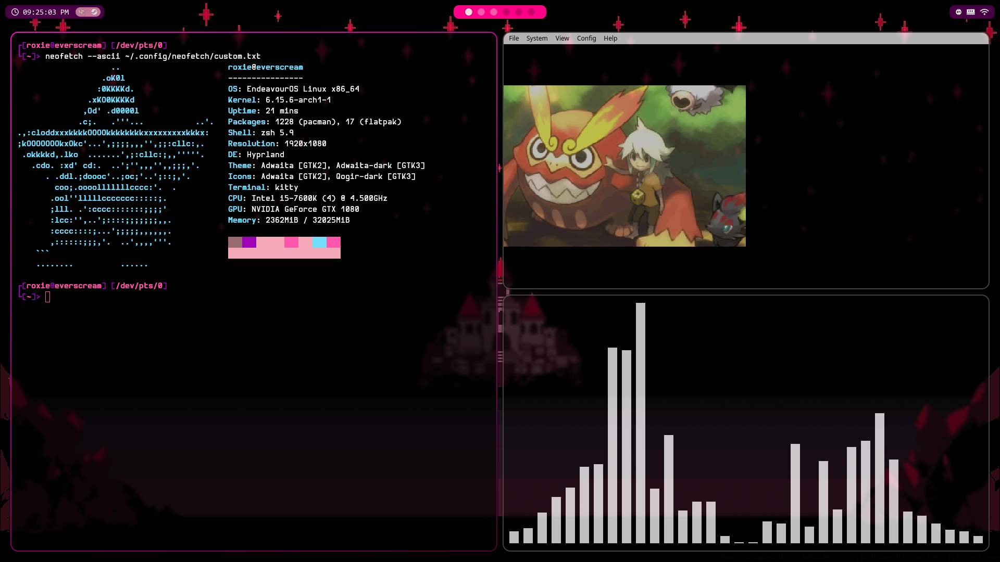

# dotfiles
my dotfiles yayyyy

# credits
- i got the waybar config from [AmyCur/Woke-Dot-Files](https://github.com/AmyCur/Woke-Dot-Files) and modified it to fit what i wanted
- i got the swaync from multiple places, smushed it together and then changed some themeing and some colors
    - https://github.com/Seme4eg/dotfiles/tree/master/.config/swaync
    - https://gist.github.com/MrRoy/40f103bc34f3a58699e218c3d06d1a43
    - https://gist.github.com/MrRoy/3a4a0b1462921e78bf667e1b36697268

# to use
im not sure where in this requires the photos but i use 2 directorys for important pictures
- ~/Pictures/sys/wallpaper.png
- ~/Pictures/sys/pfp.png

# preview


<table>
  <tr>
    <td>
        <table>
            <tr>
                <td></td>
                <td></td>
            </tr>
            <tr>
                <td></td>
                <td></td>
            </tr>
        </table>
    </td>
  </tr>
</table>

# software
Im not fully sure on the list of software i have but this sould probably cover it
```sh
sudo pacman -S waybar hyprland hyprlock hyprpaper hypridle kitty swaync wofi cava
```
```sh
yay -S neofetch
```

<hr>

if youre using these then i hope you like em, if its me haiiiii, i do not care for credits its just a config really